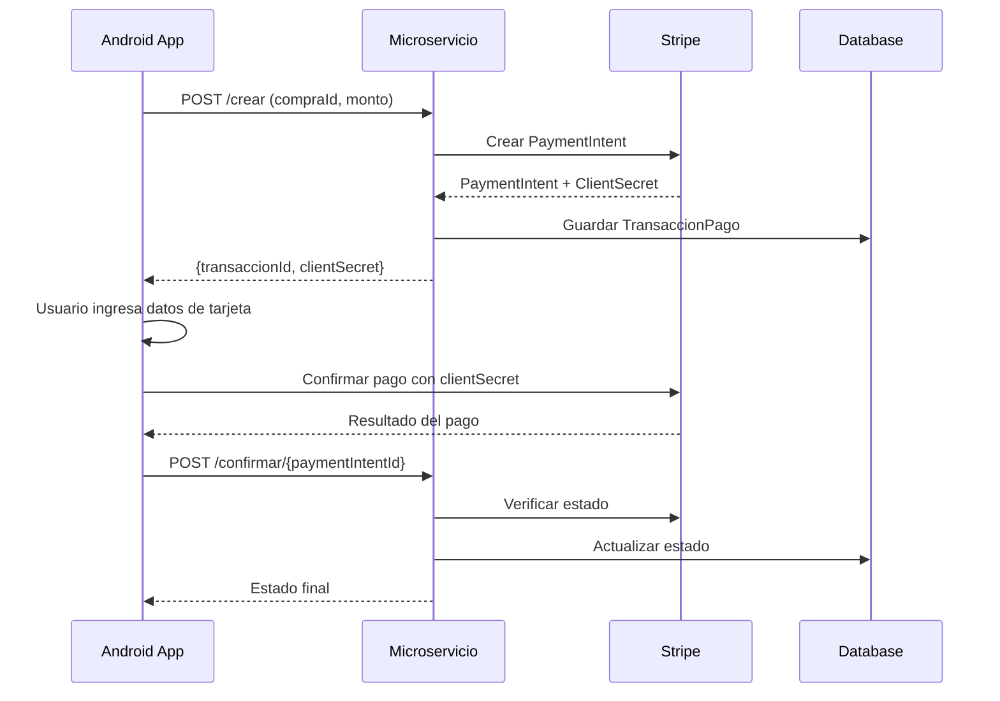

# Sistema de Pagos - Microservicio Farmacia DeY

## Descripción

Este módulo implementa un sistema completo de pagos para la farmacia, integrando el microservicio existente de `metodopago` con Stripe como proveedor de pagos externo. Permite procesar pagos de forma segura y mantener un registro completo de todas las transacciones.

## Características

### ✅ Funcionalidades Implementadas

1. **Integración con Stripe**: Utiliza Stripe como procesador de pagos externo
2. **Gestión de TransaccionesPago**: Sistema completo de seguimiento de transacciones
3. **Estados de Pago**: Control de estados (PENDIENTE, PROCESANDO, COMPLETADA, FALLIDA, CANCELADA, REEMBOLSADA)
4. **API REST**: Endpoints para crear, confirmar y cancelar pagos
5. **Base de Datos**: Persistencia en MySQL con Hibernate
6. **Logging**: Sistema de logs para auditoría y debugging

### 🎯 Arquitectura

```
┌─────────────────┐    ┌─────────────────┐    ┌─────────────────┐
│   Android App   │───▶│  Microservicio  │───▶│     Stripe      │
│    (Frontend)   │    │   metodopago    │    │   (Payments)    │
└─────────────────┘    └─────────────────┘    └─────────────────┘
                               │
                               ▼
                       ┌─────────────────┐
                       │     MySQL       │
                       │   (Database)    │
                       └─────────────────┘
```

## Configuración

### Requisitos

- Java 21
- Maven 3.6+
- MySQL 8.0+
- Cuenta de Stripe (modo test)

### Variables de Configuración

En `application.properties`:

```properties
# Configuración Stripe (IMPORTANTE: Usar claves reales para pruebas)
stripe.secret.key=sk_test_tu_clave_secreta_de_stripe
stripe.public.key=pk_test_tu_clave_publica_de_stripe

# Puerto del microservicio
server.port=7014
server.servlet.context-path=/metodopago

# Base de datos
spring.datasource.url=jdbc:mysql://127.0.0.1:3306/farmaciadey
spring.datasource.username=root
spring.datasource.password=tu_password
```

### Obtener Claves de Stripe

1. Crear cuenta en [https://stripe.com](https://stripe.com)
2. Ir a Dashboard → Developers → API Keys
3. Copiar las claves de Test (comienzan con `sk_test_` y `pk_test_`)
4. Reemplazar en `application.properties`

## API Endpoints

### Base URL
```
http://localhost:7014/metodopago/api/v1/pagos
```

### 1. Health Check
```http
GET /health
```

**Respuesta:**
```json
{
  "status": "UP",
  "service": "metodopago",
  "version": "1.0.0",
  "message": "Servicio de pagos funcionando correctamente"
}
```

### 2. Crear Pago
```http
POST /crear
Content-Type: application/json

{
  "compraId": 123,
  "monto": 50.00,
  "moneda": "USD",
  "metodoPagoId": 1,
  "descripcion": "Pago por medicamentos"
}
```

**Respuesta:**
```json
{
  "success": true,
  "transaccionId": 1,
  "paymentIntentId": "pi_1234567890",
  "clientSecret": "pi_1234567890_secret_xyz",
  "estado": "PROCESANDO",
  "monto": 50.00,
  "moneda": "USD",
  "message": "PaymentIntent creado exitosamente"
}
```

### 3. Confirmar Pago
```http
POST /confirmar/{paymentIntentId}
```

**Respuesta:**
```json
{
  "success": true,
  "transaccionId": 1,
  "estado": "COMPLETADA",
  "compraId": 123,
  "monto": 50.00,
  "fechaPago": "2025-11-03T12:00:00",
  "message": "Estado de pago confirmado"
}
```

### 4. Cancelar Pago
```http
POST /cancelar/{paymentIntentId}
```

### 5. Obtener Estado de Transacción
```http
GET /estado/{transaccionId}
```

## Modelo de Datos

### TransaccionPago

```sql
CREATE TABLE transaccion_pago (
    id BIGINT AUTO_INCREMENT PRIMARY KEY,
    compraId BIGINT NOT NULL,
    monto DECIMAL(10,2) NOT NULL,
    moneda VARCHAR(3) NOT NULL DEFAULT 'USD',
    metodoPagoId BIGINT NOT NULL,
    estado ENUM('PENDIENTE','PROCESANDO','COMPLETADA','FALLIDA','CANCELADA','REEMBOLSADA'),
    referenciaExterna VARCHAR(200), -- Stripe PaymentIntent ID
    clientSecret VARCHAR(200),
    descripcion VARCHAR(500),
    detallesRespuesta TEXT,
    fechaCreacion DATETIME NOT NULL,
    fechaActualizacion DATETIME,
    fechaPago DATETIME,
    eliminado INT DEFAULT 0
);
```

## Flujo de Pago

### 1. Flujo Completo



### 2. Estados de Transacción

- **PENDIENTE**: Transacción creada, esperando procesamiento
- **PROCESANDO**: PaymentIntent creado en Stripe, esperando confirmación
- **COMPLETADA**: Pago procesado exitosamente
- **FALLIDA**: Error en el procesamiento
- **CANCELADA**: Pago cancelado por usuario o sistema
- **REEMBOLSADA**: Pago reembolsado

## Pruebas

### Tarjetas de Prueba de Stripe

```bash
# Tarjeta que siempre funciona
4242424242424242

# Tarjeta que requiere autenticación 3D Secure
4000002500003155

# Tarjeta que siempre falla
4000000000000002
```

### Ejemplos de Prueba

```bash
# 1. Verificar que el servicio esté corriendo
curl -X GET http://localhost:7014/metodopago/api/v1/pagos/health

# 2. Crear un pago de prueba
curl -X POST http://localhost:7014/metodopago/api/v1/pagos/crear \
  -H "Content-Type: application/json" \
  -d '{
    "compraId": 1,
    "monto": 25.50,
    "moneda": "USD",
    "metodoPagoId": 1,
    "descripcion": "Prueba de pago - Medicamentos"
  }'

# 3. Verificar estado de transacción
curl -X GET http://localhost:7014/metodopago/api/v1/pagos/estado/1
```

## Integración con Android

### 1. Agregar Dependencia de Stripe

```gradle
implementation 'com.stripe:stripe-android:20.+'
```

### 2. Código de Ejemplo

```kotlin
// 1. Crear pago en tu backend
val createPayment = api.crearPago(compraId, monto, metodoPagoId)
val clientSecret = createPayment.clientSecret

// 2. Configurar Stripe
val stripe = Stripe(applicationContext, "pk_test_tu_clave_publica")

// 3. Procesar pago
stripe.confirmPayment(
    this,
    ConfirmPaymentIntentParams.create(
        clientSecret,
        PaymentMethodCreateParams.create(card)
    )
)
```

## Seguridad

### Consideraciones Importantes

1. **Claves de API**: Nunca expongas las claves secretas de Stripe
2. **HTTPS**: Usar siempre HTTPS en producción
3. **Validación**: Validar todos los datos de entrada
4. **Webhooks**: Implementar webhooks de Stripe para sincronización automática
5. **Logs**: No loggear información sensible de tarjetas

## Próximos Pasos

### 🚧 Pendientes de Implementación

1. **Webhooks de Stripe**: Para sincronización automática de estados
2. **Reembolsos**: Funcionalidad de reembolsos
3. **Métodos de Pago Adicionales**: PayPal, transferencias bancarias
4. **Reportes**: Dashboard de pagos y estadísticas
5. **Notificaciones**: Envío de emails/SMS de confirmación

## Troubleshooting

### Problemas Comunes

1. **Error de conexión a MySQL**: Verificar que MySQL esté corriendo y la BD existe
2. **Error de Stripe**: Verificar claves de API y conexión a internet
3. **Puerto ocupado**: Cambiar puerto en `application.properties`

### Logs Útiles

```bash
# Ver logs del microservicio
tail -f logs/metodopago.log

# Ver logs de Stripe en Dashboard
https://dashboard.stripe.com/test/logs
```

## Contacto

Para soporte técnico o preguntas sobre el sistema de pagos, contactar al equipo de desarrollo.

---

**⚠️ IMPORTANTE**: Este es un sistema de prueba. Para producción, asegurar todas las configuraciones de seguridad y usar claves reales de Stripe.